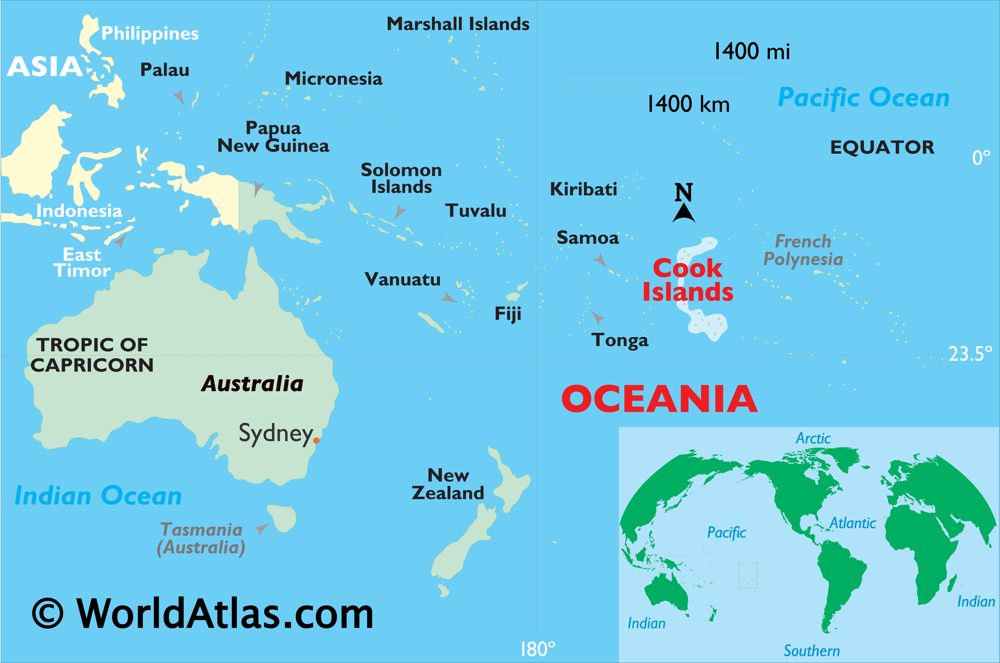
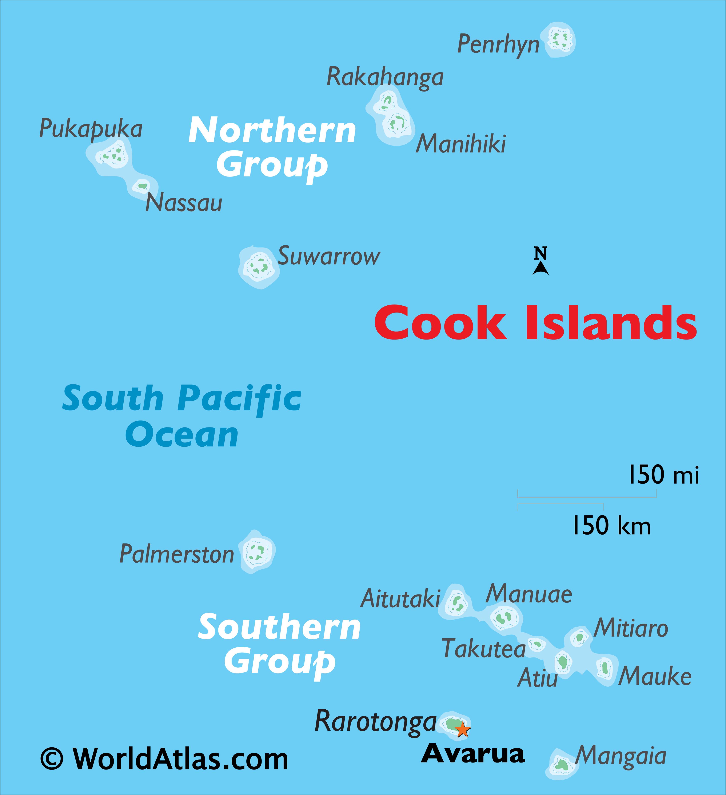

# Introduction

- Kia orana kātoa! Ko Quartz tōku ingoa. 

- Kā tuatua au nō te Māori Kūki 'āirani i tēia rā.

--

- (I'm a beginner in the language, so this is about all I got, sorry hahaha)

```{r, fig.align = "center", echo=FALSE, out.width="70%"}

```


---

# Research questions

1. How does duration of w~v vary by island?

2. How does intensity of w~v vary by island? 

3. Does voicing of w~v vary by island? 

4. Which island(s) have more or less [w] tokens surfacing instead of [v]s? 

--

## Why though?

It's known across both Aotearoa (NZ) Māori and CIM that some speakers regularly pronounce [v] as [w], but it isn't clear to anyone who does this more and what conditions it!

---
# Cook Islands Māori (background)

- Eastern Polynesian language, VSO is the unmarked word order

- Closely related, but definitely different from Aotearoa Māori

- Classified as Endangered and there is little intergenerational transmission :(

--

- I work as a contract transcriber on a project documenting CIM, so I got this data from my supervisors (**Ake ē Rolando, meitaki!**)

```{r, fig.align = "center", echo=FALSE, out.width="60%"}

```

---
# Cook Islands Māori (background)

```{r, fig.align = "center", echo=FALSE, out.width="90%", fig.cap="Map of Oceania."}

```

---
# Cook Islands Māori (background)

```{r, fig.align = "center", echo=FALSE, out.width="55%", fig.cap="Map of Cook Islands."}

```

```{r}
#| label: read-csv
#| echo: false
#| message: false
#| warning: false

library("tidyverse")
library("tidyr")
library("here")
library("mgcv")
library("broom")

source(here::here("scripts", "libs.R"))

untidy_data <- read_csv(here("untidy_data", "cim-v-w-202410.csv"))

```

---
## Data overload

```{r}
#| label: glimpse-cim
#| message: false
#| echo: false
#| warning: false

glimpse(untidy_data)

```


**Omg.... I can fix her!**

---
## Data overload

- **Speaker:** just their initials (no 'id' column)

- **Island:**  either Atiu, Mauke, Penrhyn, or Rarotonga

- **Filename:** refers to the audio file this was extracted from

- **PreviousLabel**/**FollowingLabel:** phoneme that precedes/follows

- **Start**/**End:** the start and end times for that phoneme

- **Duration:** *total* duration of the phoneme

- **Percent:** the 20% 50% and 80% marks of the phoneme's total duration

- **F0.point:** f0 measured in Hz at that percent of the phoneme's duration

- **F2_midpoint:** f2 measured in Hz at the midpoint of the phoneme

- **Intensity_midpoint:** intensity midpoint of the phoneme

---
# Duration by island

## Tidy!

```{r}
#| label: tidy-duration
#| echo: true
#| message: false
#| warning: false

tidy_dur <- untidy_data |>
  filter(TextGridLabel == "v") |>  
  arrange(island, Word) |>  
  select(speaker, island, word = Word, duration) |>
  write_csv(here("tidy_data", "tidy_dur.csv"))

```

--

```{r}
#| label: glimpse-duration
#| echo: false
#| warning: false
#| message: false

knitr::kable(head(tidy_dur))

```

---
# Duration by island 

## Plot!

.pull-left[
```{r}
#| label: duration-plot
#| warning: false
#| message: false
#| echo: true

plot_dur <- tidy_dur |>
  ggplot() +
  aes(x = island, y = duration, color = island) +
  geom_boxplot() +
  labs(
    title = "Compare [v] duration by island",
    x = "Island",
    y = "Duration"
  ) 
```
]

--

.pull-right[
```{r}
#| label: print-dur
#| echo: false
#| message: false
#| warning: false

print(plot_dur)
```
]
---
# Duration by island

## Model

```{r}
#| label: mod-duration
#| echo: true
#| message: false
#| warning: false

mod_dur <- lm(formula = duration ~ island, data = tidy_dur)
```

```{r}
#| label: summary-duration
#| echo: false
#| message: false
#| warning: false

dur_summary <- tidy(mod_dur)

knitr::kable(dur_summary)

```


---
# Intensity by island 

## Tidy!


```{r}
#| label: tidy-intensity
#| echo: true
#| warning: false
#| message: false

tidy_intense <- untidy_data |>
  filter(TextGridLabel == "v") |>  
  arrange(island, Word) |>  
  select(speaker, island, word = Word, intensity = intensity_midpoint) |>
  write_csv(here("tidy_data", "tidy_intense.csv"))

```

--

```{r}
#| label: glimpse-intense
#| echo: false
#| message: false
#| warning: false

knitr::kable(head(tidy_intense))

```

---
# Intensity by island 

## Plot
.pull-left[
```{r}
#| label: intensity-by-island
#| warning: false
#| message: false
#| echo: true
#| out-width: "60%"

plot_intense <- tidy_intense |>
  ggplot() +
  aes(x = island, y = intensity, color = island) +
  geom_boxplot() +
  labs(
    title = "Compare [v] intensity by island",
    x = "Island",
    y = "Intensity"
  ) 

```
]
--
.pull-right[
```{r}
#| label: print-intensity-plot
#| echo: false
#| warning: false
#| message: false

print(plot_intense)

```
]

---
# Intensity by island 

## Model

```{r}
#| label: mod-intensity
#| echo: true
#| message: false
#| warning: false

mod_intense <- lm(formula = intensity ~ island, data = tidy_intense)

```

```{r}
#| label: summary-intensity
#| echo: false
#| warning: false
#| message: false

intense_summary <- tidy(mod_intense)

knitr::kable(intense_summary)

```


---
# Results 

**Duration**

- Penrhyn has the longest average w~v durations and Rarotonga has the shortest

- Penrhyn has the largest range in durations

- Atiu and Mauke have pretty similar w~v durations

--

**Intensity**

- Penrhyn has the lowest average intensity midpoints (its entire range is lowest)

- Mauke and Rarotonga have pretty high ranges, but for Rarotonga the values are more concentrated around the mean (the box itself is smaller)

- Atiu has the smallest range for intensity and the values are concentrated around the mean 


---
# Voicing by island

### Useful info

**F0**

- [w] can be voiceless, so its F0 is either super low or absent (below than 80 Hz = voiceless)

- [v] is voiced, so F0 is always there, and is a higher F0 than for [w]

--

### What I'm doing

- We use f0 values for the target phoneme to see how voicing for w~v differs across the four islands in this data set. 

- F0 values were extracted at the 20%, 50% and 80% points of the duration of the target phoneme. 

---
# F0 by island 


**fill in???**


---
# F2 by island

**Why F2?**

- [w] has a lower F2 than [v]

**Note:**

- F2 values were only extracted at the midpoint of the phoneme.

---
#F2 by island

## Tidy!


```{r}
#| label: tidy-f2
#| echo: true
#| message: false
#| warning: false

tidy_f2 <- untidy_data |>
  filter(TextGridLabel == "v") |>
  arrange(island, Word) |>  
  select(speaker, island, word = Word, f2 = F2_midpoint) |>
  write_csv(here("tidy_data", "tidy_f2.csv"))

```

--

```{r}
#| label: glimpse-f2
#| echo: false
#| message: false
#| warning: false

knitr::kable(head(tidy_f2))

```

---
# F2 by island 

## Plot!

.pull-left[
```{r}
#| label: plot-f2
#| echo: true
#| message: false
#| warning: false

f2_plot <- tidy_f2 |>
  ggplot() +
  aes(x = island, y = f2, color = island) +
  geom_boxplot() +
  labs(
    title = "Compare [v] F2 by island",
    x = "Island",
    y = "F2 (Hz)"
  )
```
]

--

.pull-right[
```{r}
#| label: print-f2-plot
#| echo: false
#| warning: false
#| message: false

print(f2_plot)

```
]

---
# F2 by island 

## Model 

```{r}
#| label: mod-f2
#| echo: true
#| message: false
#| warning: false

mod_f2 <- lm(formula = f2 ~ island, data = tidy_f2)

```

```{r}
#| label: summary-f2
#| message: false
#| echo: false
#| warning: false

f2_summary <- tidy(mod_f2)

knitr::kable(f2_summary)

```


---
# Formant results 

### Great, so what does this all mean?

**F0**

- Mauke is the only one that seems to *regularly* have voiceless [w] in place of 'v', but it also has the biggest overall range for f0 Hz

- the other 3 islands typically have f0 \> 100 Hz, so these tokens are voiced

- **SO,** we would expect f2 values to also say that Mauke has more [w] than [v] surfacing


---
# Formant results 

### The voicing question

- Based on the f2 boxplot, the lowest mean f2 is Atiu, then Penrhyn, Mauke, then Rarotonga

- a lower f2 indicates [w], so Atiu should, on average, have more [w]-surfacing and Rarotonga should have the least occurrances of [w]-surfacing (more [v])

- **So, it seems that f0 was not a good predictor for the [w] vs. [v] question, but it did reveal that Mauke has a higher rate of voiceless [w], when [w] is realized**

---
# Formant results

### The w~v question 

- a 'low f2' that indicates [w] is \<850 Hz

- **all** of these 4 islands have instances of [w], and their means are all slightly (or much) higher than this cut-off, so they all averagely surface as [v]

- based on the boxplots for f2, all of the islands except Penrhyn have a lot of tokens where 'v' surfaces as [w]


---
.center[
# Meitaki!

# Thank you! 

# ¡Gracias!
]


