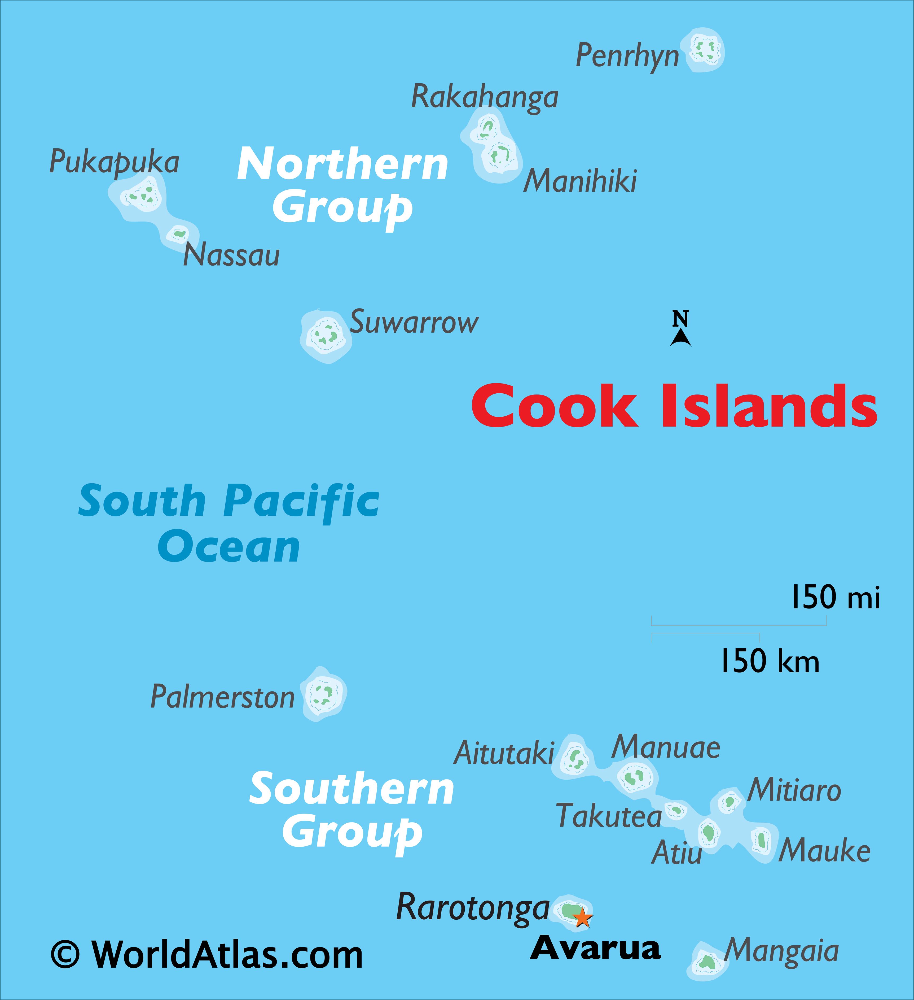
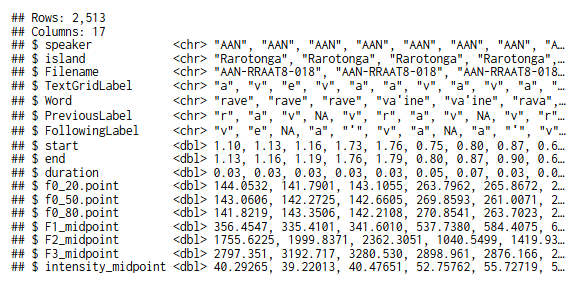

```{r include = FALSE}
#| label: setup-libs

library("tidyverse")
library("papaja")
library("ds4ling")
library("tidyr")
library("here")
library("lme4")
library("mgcv")
library("devtools")
library("broom")
library("ggplot2")
library("lmerTest")
theme_update(# axis labels
             axis.title = element_text(size = 17),
             # tick labels
             axis.text = element_text(size = 10),
             # title 
             title = element_text(size = 20))

source(here::here("scripts", "libs.R"))

untidy_data <- read_csv(here("untidy_data", "cim-v-w-202410.csv"))

```


# 1.0 Introduction

In this paper, we will do a statistical analysis of [v] across a sample of islands in Cook Islands Māori (CIM). It is known that in many dialects and other varieties of Māori, this phoneme can be realized as [w] or [v]. This paper aims to take a statistical approach to this generalization. 

This paper has four sub-questions to investigate. First, how does the duration of w~v vary by island and second, how does intensity for w~v vary by island. The other two questions are about identifying information about the surface forms of w~v by island. Specifically, we will model f0 and f2 to determine whether certain islands realize a devoiced phoneme. Finally, an f2 model will help us determine which islands have higher rates of [w]s surfacing and which have more [v]s surfacing.

## 1.1 Background (CIM)

Cook Islands Māori is an Eastern Polynesian language indigenous to the Cook Islands. CIM is classified as *Endangered* and has little intergenerational transmission. It is very closely related to Aotearoa Māori (New Zealand Māori), but is definitely different enough to be classified as a separate, but related language. 

It is known across both Aotearoa Māori and CIM speakers that some speakers regularly pronounce their [v]s as [w]s, but it is not clear to anyone who does this more and what conditions it.

In hopes of answering this question, I will compare various aspects of w~v phonemes across a sample of the Cook Islands. The islands in this study are Atiu, Mauke, Penrhyn, and Rarotonga. 


```{r, fig.align = "center", echo=FALSE, out.width="50%"}



```

In the map above, you can see that Penrhyn is far in the northern group while the other three islands in our sample are part of the southern group. Lastly, it's relevant to note that Rarotongan CIM is considered to be the standard dialect of CIM and it hosts the capital of the Cook Islands. 

# 2.0 Methods

The data for this project comes from a [**large digital corpus**](https://catalog.paradisec.org.au/collections/SN1) managed by [**PARADISEC**](https://www.paradisec.org.au/) (Nicholas 2012). Much of the data in this corpus was collected for Nicholas's dissertation work and while there is a *lot* of data, it is largely unorganized. 

In order to make large corpora like this as useful for linguistic research or revitalization projects as possible, the data needs to be fully annotated and organized. Given the sheer amount of data, it would take humans too long to annotate it all, and thus a team of linguists and Cook Islanders have started working together to develop NLP tools to accelerate this documentation (Coto-Solano et al. 2018). 

As part of this broader collaborative NLP project, they have trained an improved forced alignment tool for CIM. So far, forced-aligned data has been used to investigate the glottal stop phoneme (Coto-Solano et al. 2018), but this segmented data can be used to do all kinds of phonetic analysis. 

The data in this paper comes from the PARADESEC corpus and was aligned by phoneme, and then corrected. The final Praat TextGrids are also available in the corpus. All acoustic measurements for these phonemes were extracted from Praat. 

To reiterate, all of the data collection and processing to a usable format for this project was not done by me. Full credit for all of those previous steps goes to the linguists who worked on data collection and processing the data (Coto-Solano et al. 2018).


# 3.0 Data

The following large data set has many columns. Here I show a preview of the data set and then discuss which columns will be relevant to the analysis later in  the paper. 

```{r, fig.align = "center", echo=FALSE, out.width="60%", retina=3}

```

First, note that there is no 'id' column but there is a column for the speaker's initials. I will use speaker in place of 'id' because that is what was in this original data set. The 'island' column states what island that speaker is from. This data only contains data from the four islands Atiu, Mauke, Penrhyn and Rarotonga. Duration corresponds to the total duration of the phoneme, and intensity is measured at the midpoint of the phoneme.

F0 values were taken at 20%, 50% and 80% of each phoneme's total duration. Later, we will opt to use only the F0 values at 50%, but that will be discussed more later. Finally, F2_midpoint is f2 measured in Hz at the midpoint of that phoneme. 

All of the other columns are either straight-forward information or will be irrelevant for this paper. 

# 4.0 Analysis

This section readdresses the main questions about the w~v alternation. First, how does duration differ by island and second, how does intensity vary by island? Finally, do any islands have regular occurrence of [w] instead of [v] surfacing. For this final question, we will compare f0 and f2 separately. 

Note that in all of my models, I did not control for where w~v occurs in the word, since I am looking at general frequency information and not doing a phonological analysis of specific environments in which [w] or [v] occurs more. Another important thing to note is that for each island, there were different numbers of speakers contributing to the data set. All of the Atiu data came from one speaker and it was the same for Penrhyn. The Mauke data came from four speakers and the Rarotonga data came from five speakers. 

Since there are different numbers of speakers from each of these islands, the models I will use to investigate each question will be linear mixed models. 


## 4.1 Duration by island 

The first step of comparing duration of w~v across these four islands is to make a smaller, tidy data set that only contains the relevant information. 

Below, I filter the data so that it only contains rows with the "v" phoneme. Then I arrange it by island and then by word, and I select only the columns "speaker", "island", "word" and duration. Finally, I save this filtered data set as a new csv file.

```{r}
#| label: tidy-duration
#| echo: false
#| message: false
#| warning: false

tidy_dur <- untidy_data |>
  filter(TextGridLabel == "v") |>  
  arrange(island, Word) |>  
  select(speaker, island, word = Word, duration) |>
  write_csv(here("tidy_data", "tidy_dur.csv"))

```

The tidied duration dataset looks like this. 

```{r, fig.align = "center", echo=FALSE, out.width="60%"}
#| label: glimpse-duration
#| warning: false
#| message: false

knitr::kable(head(tidy_dur))

```

For a visual comparison, we will look at boxplots comparing duration across these four islands.

```{r}
#| label: duration-plot
#| warning: false
#| message: false
#| echo: false

plot_dur <- tidy_dur |>
  ggplot() +
  aes(x = island, y = duration, color = island) +
  geom_boxplot() +
  labs(
    x = "Island",
    y = "Duration"
  )

```


```{r, fig.align = "center", echo=FALSE, out.width="50%"}
#| label: print-duration-plot
#| warning: false
#| message: false

print(plot_dur)

```

The boxplot shows that average (mean) durations were pretty similar across these three islands. But for some reason, Penrhyn had a much larger range of durations than the other islands. 

Now that we have an idea of what the general differences and similarities are for duration, we can fit the linear mixed effect model. In the code chunk. you can see that I account for the fact that number of speakers varies across the islands in the data set, and also that there are many instances of each word. These instances of each 'word' are repeated by each speaker multiple times and by several speakers multiple times. 


```{r}
#| label: mod-duration
#| echo: true
#| message: false
#| warning: false

mod_dur <- lmer(duration ~ island + (1|speaker) + (1|word), data = tidy_dur)

```


## 4.2 Intensity by island

Next is the intensity comparison across the four islands. Starting from the raw data set, we must filter it again so that it only has instances of the "v" phoneme and we filter everything except the "speaker", "island", "word", and "intensity" columns. The tidying process is shown in the code chunk here. 

```{r}
#| label: tidy-intensity
#| echo: false
#| warning: false
#| message: false

tidy_intense <- untidy_data |>
  filter(TextGridLabel == "v") |>  
  arrange(island, Word) |>  
  select(speaker, island, word = Word, intensity = intensity_midpoint) |>
  write_csv(here("tidy_data", "tidy_intense.csv"))

```

Once the new data set has been made, it looks roughly like the following table, but extended of course. 

```{r}
#| label: glimpse-intense
#| echo: false
#| message: false
#| warning: false

knitr::kable(head(tidy_intense))

```

In the same way we did for the duration question, we will first look at a boxplot to visually see any clear differences in intensity across the Cook Islands.


```{r}
#| label: intensity-by-island
#| warning: false
#| message: false
#| echo: false

plot_intense <- tidy_intense |>
  ggplot() +
  aes(x = island, y = intensity, color = island) +
  geom_boxplot() +
  labs(
    x = "Island",
    y = "Intensity"
  ) 

```

```{r, fig.align = "center", echo=FALSE, out.width="75%"}
#| label: print-intensity-plot
#| warning: false
#| message: false

print(plot_intense)

```

Initially, it is clear that Penrhyn has the lowest mean intensity for w~v. Mauke and Rarotonga have nearly the same mean intensity, and Atiu's mean is slighly lower, but not as low as Penrhyn's mean.

Now that we know the general patterns, we can fit our linear mixed effects model. Dur to the same reasons as before, I model speaker and word as mixed effects in the intensity by island model. The code chunk below shows how I fit the model in R. 


```{r}
#| label: mod-intensity
#| echo: true
#| message: false
#| warning: false

mod_intense <- lmer(intensity ~ island + (1|speaker) + (1|word), data = tidy_intense)

```


## 4.3 Voicing by island 

Moving on to the formant questions, first we will investigate how voicing of w~v differs across these four islands. In acoustic measurements, an F0 lower than 80 Hz is considered voiceless. 

This time, we tidy the raw data set in a similar way but with one additional step. Since we have f0 values at three different intervals of the same morpheme, if we were to put all of those formant values in a new column and the percentage in another new column, then it would fabricate 3 times as many tokens that were not elicited from the speakers. 

In order to limit this autocorrelation issue, I chose to only keep f0 values at the 50% interval of the phoneme. I chose the 50% interval because the middle of the duration seemed like the smartest choice to represent the average f0 value across the phoneme's duration. 

```{r}
#| label: tidy-f0
#| echo: false
#| message: false
#| warning: false

tidy_f0 <- untidy_data |>
  filter(TextGridLabel == "v") |>
  pivot_longer(
    cols = c("f0_50.point"), 
    names_to = "percent",
    values_to = "f0"
  ) |>
  arrange(island, Word) |>  
  select(speaker, island, word = Word, f0, duration) |>
  write_csv(here("tidy_data", "tidy_f0.csv"))

```

Once we have made this new, tidy data set, it looks like this. Again, if I showed the full table, it would have more than this one word and this one island. This is just the top few rows of the sorted table.

```{r}
#| label: glimpse-f0
#| echo: false
#| message: false
#| warning: false

knitr::kable(head(tidy_f0))

```

This time, to compare f0 across the islands visually, we can plot this data onto a scatterplot. 

```{r}
#| label: plot-f0
#| echo: false
#| message: false
#| warning: false

f0_plot <- tidy_f0 |>
  ggplot() + 
  aes(x = duration, y = f0, color = speaker) +
  geom_point() +
  geom_smooth(
    method="glm",
    color="black",
    method.args = list(family = "poisson")
  ) +
  facet_grid(.~island,
             scales = "free_x") +
  labs(
    x = "Duration", 
    y = "F0 (Hz)"
  ) 
```

As you can see, I created an individual facet for each island and each color represents data from a particular speaker. 

```{r, fig.align = "center", echo=FALSE, out.width="90%", retina=3}
#| label: print-f0-plot
#| message: false
#| warning: false

print(f0_plot)

```

It is clear that the most drastic slope is in the Penrhyn plot, and the data for the islands with more speakers are much more spread out across the plot. To formally compare these different variables, we can again use a linear mixed effects model to see how f0 varies across these four Cook Islands. The model fitting is shown in the code chunk below. 

```{r}
#| label: mod-f0
#| echo: true
#| message: false
#| warning: false

mod_f0 <- lmer(f0 ~ island + (1|speaker) + (1|word), data = tidy_f0)

```


## 4.4 w~v distribution by island

Finally we turn to the main research question: is there a correlation between island and how many [w] tokens surface? The acoustic measurement indicating a [w] is **less than 850 Hz.**

For this question, we tidy the raw data set once again so that it only has data for "v", speaker, island, word, and f2 values. 

```{r}
#| label: tidy-f2
#| echo: false
#| message: false
#| warning: false

tidy_f2 <- untidy_data |>
  filter(TextGridLabel == "v") |>
  arrange(island, Word) |>  
  select(speaker, island, word = Word, f2 = F2_midpoint) |>
  write_csv(here("tidy_data", "tidy_f2.csv"))

```

Once the data has been tidied, it generally looks like this. 

```{r}
#| label: glimpse-f2
#| echo: false
#| message: false
#| warning: false

knitr::kable(head(tidy_f2))

```

To visually compare the f2 values across these islands, we generate another boxplot. 

```{r}
#| label: plot-f2
#| echo: false
#| message: false
#| warning: false

f2_plot <- tidy_f2 |>
  ggplot() +
  aes(x = island, y = f2, color = island) +
  geom_boxplot() +
  labs(
    x = "Island",
    y = "F2 (Hz)"
  )

```

```{r, fig.align = "center", echo=FALSE, out.width="75%"}
#| label: print-f2-plot
#| warning: false
#| message: false

print(f2_plot)

```

From looking at the f2 boxplot, it's clear that Atiu has the lowest mean f2. The other three islands had more similar means, but Mauke and Penrhyn had some instances of w~v that had extremely high F2 measurements. Regardless, the boxes for each island look different, so we know what to expect when we fit a linear mixed effects model. The code chunk for fitting this model is below.

```{r}
#| label: mod-f2
#| echo: true
#| message: false
#| warning: false

mod_f2 <- lmer(f2 ~ island + (1|speaker) + (1|word), data = tidy_f2)
```


## 5.1 Results

Model summary table for **duration.**

```{r}
#| label: duration-mods
#| echo: false
#| message: false
#| warning: false

dur_null <- lm(duration ~ 1, data = tidy_dur)

dur_island <- lm(duration ~ island, data = tidy_dur)

dur_add <- lmer(duration ~ island + (1|speaker), data = tidy_dur)

dur_anova <- anova(mod_dur, dur_add, dur_island, dur_null)

knitr::kable(dur_anova)

```

Model summary for **intensity.**

```{r}
#| label: intensity-mods
#| echo: false
#| message: false
#| warning: false

intensity_null <- lm(intensity ~ 1, data = tidy_intense)

intensity_island <- lm(intensity ~ island, data = tidy_intense)

intensity_add <- lmer(intensity ~ island + (1|speaker), data = tidy_intense)


intensity_anova <- anova(mod_intense, intensity_add, intensity_island, intensity_null)

knitr::kable(intensity_anova)

```

Model summary for voicing (f0).

```{r}
#| label: f0-mods
#| echo: false
#| message: false
#| warning: false

f0_null <- lm(f0 ~ 1, data = tidy_f0)

f0_island <- lm(f0 ~ island, data = tidy_f0)

f0_add <- lmer(f0 ~ island + (1|speaker), data = tidy_f0)


f0_anova <- anova(mod_f0, f0_add, f0_island, f0_null)

knitr::kable(f0_anova)

```


Model summary for f2.

```{r}
#| label: f2-mods
#| echo: false
#| message: false
#| warning: false

f2_null <- lm(f2 ~ 1, data = tidy_f2)

f2_island <- lm(f2 ~ island, data = tidy_f2)

f2_add <- lmer(f2 ~ island + (1|speaker), data = tidy_f2)


f2_anova <- anova(mod_f2, f2_add, f2_island, f2_null)

knitr::kable(f2_anova)

```


***SUMMARIZE***


Recall that we had the following p-values in each model for each island. 

```{r}
#| label: p-vals-table
#| echo: false
#| message: false
#| warning: false

p_vals <- data.frame(
  Island = c("Atiu", "Mauke", "Penrhyn", "Rarotonga"),
  Duration = c(0.00225, 0.90982, 0.32459, 0.25014),
  Intensity = c(0.00161, 0.84133, 0.62670, 0.86632),
  F0 = c(0.00702, 0.43464, 0.93276, 0.14965),
  F2 = c(1.52e-05, 0.02190, 0.02162, 0.00626)
)

knitr::kable(p_vals, align = "c", caption = "P-values from each model.")

```

In the duration model, only Atiu did *not* have a statistically significant (> 0.05) p-value (0.00225), but the other three islands had statistically significant p-values. Penrhyn and Rarotonga had very similar p-values but Mauke had a significantly higher p-value. 

In the intensity model, again, all of the islands had statistically significant p-values (> 0.05) except Atiu. The highest p-values amongst the other three islands was for Make and Rarotonga. 

The model for F0 revealed that each island except for Atiu had a significant p-value. Penrhyn had the highest p-value in the F0 column. 

Recall that an F0 value lower than **100 Hz** indicates that the phoneme is voiceless. We can tidy the F0 dataset once again to add a new column stating whether the w~v in that row surfaces as voiced or voiceless. The counts of voiced and voiceless tokens for each island are summarized in the following table.

```{r}
#| label: voicing-stats
#| echo: false
#| message: false
#| warning: false

voicing <- tidy_f0 |> 
select(island, word, f0) |> 
  mutate(voiced = if_else(
    condition = f0 > 100,
    true = "voiced",
    false = "voiceless"
    ) 
  ) 

```


```{r}
#| label: voicing-freq
#| echo: false

voicing_counts <- voicing |>
  group_by(island, voiced) |>
  summarise(total_count=n(),
            .groups = 'drop') |>
  mutate(freq = paste0(round(total_count))
  ) |>
  select(island, voiced, freq) |>
  drop_na() |>
  t()

knitr::kable(voicing_counts)

```

With the count information, we can manually calculate the percentages of voiceless w~v tokens surfacing in each group (island) of the data set. 

```{r}
#| label: voiceless-percentages
#| echo: false
#| message: false
#| warning: false
  
mauke_voiceless <- (14/(404 + 14 + 34)) * 100
  

pen_voiceless <- (1/(167 + 1 + 2)) * 100
  

raro_voiceless <- (2/(139 + 2 + 15)) * 100

```

So, to answer the voicing question, only Atiu had zero voiceless tokens surfacing. Mauke had a voiceless surface form `r mauke_voiceless`% of the time, which was the highest percentage of voiceless surface forms in the data set. Penrhyn and Rarotonga had similar rates of voiceless surface forms, with voiceless phonemes surfacing `r pen_voiceless`% of the time for Penrhyn, and `r raro_voiceless`% of the time for Rarotonga. 


Finally, the F2 model revealed no statistically significant differences in F2 values between these four islands, as all of the p-values in the F2 column are less than 0.05.

The final research question for us to address is the w~v question. An F2 value **less than 850 Hz** is taken to indicate a [w] phoneme on the surface instead of a [v]. To answer this question in percentages, we can create an additional column that states whether F2 is greater or less than 850 Hz. If F2 is less than 850, the value in the new column is "w", and if it is greater than 850, the value in the new column is "v". 

Once we have the counts of "w" and "v" surface forms for each island, we can calculate the percentages. The table with the frequency column is shown below. 


```{r}
#| label: final-form
#| echo: false
#| message: false
#| warning: false

wv_dat <- tidy_f2 |> 
  select(island, word, f2) |> 
  mutate(surface_form = if_else(
    condition = f2 > 850,
    true = "v",
    false = "w"
    ) 
  ) 

```


```{r}
#| label: w-or-v-final
#| echo: false

freq_table <- wv_dat |>
  group_by(island, surface_form) |>
  summarise(total_count=n(),
            .groups = 'drop') |>
  mutate(freq = paste0(round(total_count))
  ) |>
  select(island, surface_form, freq) |>
  drop_na() |>
  t()

knitr::kable(freq_table)

```

```{r}
#| label: real-percentages
#| echo: false
#| message: false
#| warning: false

atiu_w <- (21/(97 + 21)) * 100

  
mauke_w <- (26/(424 + 26 + 2)) * 100
  

pen_w <- (7/(163 + 7)) * 100
  

raro_w <- (5/(151 + 5)) * 100

```

I manually calculated the percentages of [w]s surfacing in each group (island) based on the frequencies in the table above. The percent of [w]s in Atiu was `r atiu_w`%, `r mauke_w`% for Mauke, `r pen_w`% for Penrhyn and `r raro_w`% for Rarotonga.


# 6.0 Conclusion

Through doing this statistical analysis of w~v tokens across Atiu, Mauke, Penrhyn, and Rarotonga, we found that duration, intensity, and F0 by island are statistically significant for all islands except Atiu. Duration was the most significant for Mauke, and intensity and F0 were the most significant for Penrhyn. 

The F2 model revealed no statistical significance between the F2 values and which island a speaker was from. 

However, to answer the voiced or voiceless question, we calculated percentages that show that all islands except Atiu had voiceless surface forms for w~v, with Mauke having the highest percentage of `r mauke_voiceless`%. 

In order to answer the final question, which islands have more [w] surface forms, we also calculated percentages. These percentages showed that all of these four islands had [w] phonemes realized, but the highest percentage of [w]s surfacing was in Atiu, where [v] was realized as [w] `r atiu_w`% of the time. 


# References

```{r create_r-references}

#r_refs(file = "r-references.bib")

```


\begingroup

Coto-Solano, Nicholas \& Wray. 2018. Development of Natural Language Processing Tools for Cook Islands Māori. In *Proceedings of Australasian Language Technology Association Workshop*, pages 26-33.


Nicholas, Sally Akevai (collector), 2012. Te Vairanga Tuatua o te Te Reo Māori o te Pae Tonga: Cook Islands Māori (Southern dialects) . Collection SN1 at catalog.paradisec.org.au [Open Access]. https://dx.doi.org/10.4225/72/56E9793466307

Thieberger \& Barwick. 2012. Keeping records of language diversity in melanesia, the pacific and regional archive for digital sources in endangered cultures (paradisec). *Melanesian languages on the edge of Asia: Challenges for the 21st Century,* pages 239-53.

\setlength{\parindent}{-0.5in}
\setlength{\leftskip}{0.5in}

\endgroup
